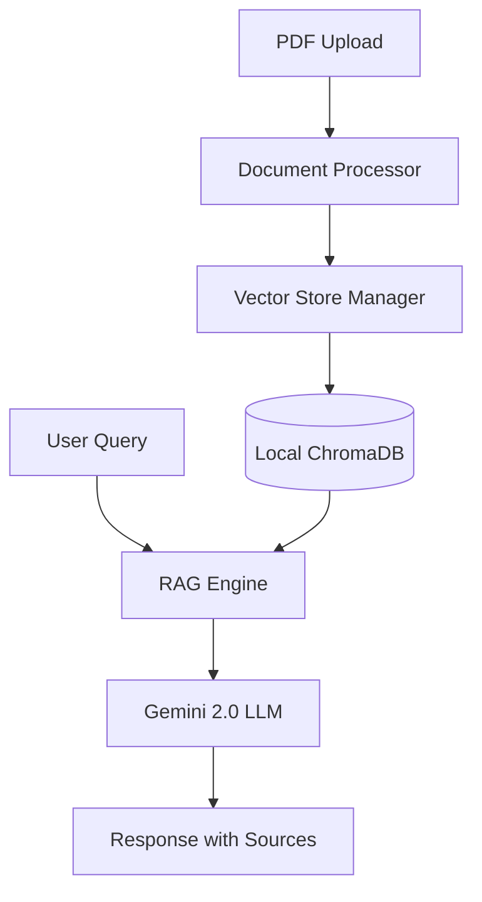

# 🤖 Modular RAG Chatbot

An production-grade, stateful RAG (Retrieval-Augmented Generation) chatbot built with **LangChain**, **Streamlit**, and **ChromaDB**. Designed for high performance, local privacy, and $0 cost.

## 🌟 Key Features
- **Conversational Memory**: Understands flow and follow-up questions using history-aware retrieval.
- **Source Attribution**: Cites specific PDF page numbers in answers.
- **Local Vectors**: Embeddings (`HuggingFace`) and database (`ChromaDB`) run 100% locally.
- **Production Standards**: Modular architecture, Google-style docstrings, and robust error handling.
- **Inspector Tool**: Built-in tab to visualize internal vector chunks and metadata.

## 🏗️ Architecture


## 🚀 Quick Start

### 1. Prerequisites
- Python 
- A Google Gemini API Key ([Get it here](https://aistudio.google.com/app/apikey))

### 2. Setup
```powershell
# Clone the repository
git clone <your-repo-link>
cd <your-directory>

# Create and activate virtual environment
python -m venv venv
.\venv\Scripts\activate

# Install dependencies
pip install -r requirements.txt
```

### 3. Environment Variables
Create a `.env` file in the root directory:
```env
GOOGLE_API_KEY=your_key_here
```

### 4. Run the App
```powershell
streamlit run app.py
```

## 📂 Project Structure
- `app.py`: Main entry point.
- `ui_components.py`: Modular Streamlit UI logic.
- `document_processor.py`: PDF loading and chunking.
- `vector_store_manager.py`: ChromaDB lifecycle management.
- `rag_engine.py`: LangChain pipeline and memory logic.

---
*Created for Workshop Demonstrations - Distributed under the MIT License.*